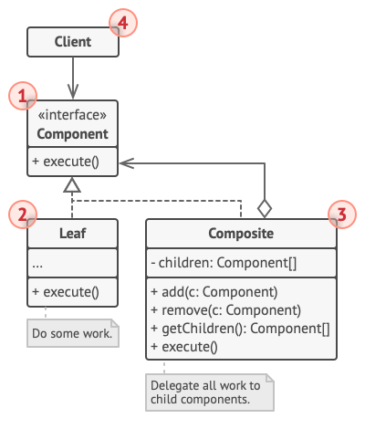

# Composite Pattern

Composite is a structural design pattern that lets you compose objects into tree structures and then work with these structures as if they were individual objects.

## Problem
For example, imagine that you have two types of objects: `Products` and `Boxes`. A `Box` can contain several `Products` as well as a number of smaller `Boxes`. These little `Boxes` can also hold some `Products` or even smaller `Boxes`, and so on.

## Solution
The Composite pattern suggests that you work with `Products` and `Boxes` through a common interface which declares a method for calculating the total price.

For a product, it’d simply return the product’s price. For a box, it’d go over each item the box contains, ask its price and then return a total for this box. If one of these items were a smaller box, that box would also start going over its contents and so on, until the prices of all inner components were calculated. 

## Structure

<p style="text-align:center">
    
</p>

- The Component interface describes operations that are common to both simple and complex elements of the tree.
- The Leaf is a basic element of a tree that doesn’t have sub-elements.
- Usually, leaf components end up doing most of the real work, since they don’t have anyone to delegate the work to.
- The Container (aka composite) is an element that has sub-elements: leaves or other containers. A container doesn’t know the concrete classes of its children. It works with all sub-elements only via the component interface.
- Upon receiving a request, a container delegates the work to its sub-elements, processes intermediate results and then returns the final result to the client.
- The Client works with all elements through the component interface. As a result, the client can work in the same way with both simple or complex elements of the tree.

## Applicability
- Use the Composite pattern when you have to implement a tree-like object structure.
- Use the pattern when you want the client code to treat both simple and complex elements uniformly.

## Pros and Cons
### Pros
- You can work with complex tree structures more conveniently: use `polymorphism` and `recursion` to your advantage.
- Open/Closed Principle. You can introduce new element types into the app without breaking the existing code, which now works with the object tree.
### Cons
- It might be difficult to provide a common interface for classes whose functionality differs too much. In certain scenarios, you’d need to overgeneralize the component interface, making it harder to comprehend.

```python
# abstract_component.py
from abc import ABC, abstractmethod


class Component(ABC):
	"""
	The base Component class declares common operations for both simple and
	complex objects of a composition.
	"""

	@property
	def parent(self):
		return self._parent

	@parent.setter
	def parent(self, parent):
		"""
		Optionally, the base Component can declare an interface for setting and
		accessing a parent of the component in a tree structure. It can also
		provide some default implementation for these methods.
		"""
		self._parent = parent
	
	"""
	In some cases, it would be beneficial to define the child-management
	operations right in the base Component class. This way, you won't need to
	expose any concrete component classes to the client code, even during the
	object tree assembly. The downside is that these methods will be empty for
	the leaf-level components.
	"""

	def add(self, component) -> None:
		pass

	def remove(self, component) -> None:
		pass

	def is_composite(self) -> bool:
		"""
		You can provide a method that lets the client code figure out whether a
		component can bear children.
		"""
		return False

	@abstractmethod
	def operation(self) -> str:
		"""
		The base Component may implement some default behavior or leave it to
		concrete classes (by declaring the method containing the behavior as
		"abstract").
		"""
		pass

# concrete_component.py
from abstract_component import Component
from typing import List


class Leaf(Component):
    """
    The Leaf class represents the end objects of a composition. A leaf can't
    have any children.

    Usually, it's the Leaf objects that do the actual work, whereas Composite
    objects only delegate to their sub-components.
    """
    def operation(self) -> str:
        return "Leaf"


class Composite(Component):
    """
    The Composite class represents the complex components that may have
    children. Usually, the Composite objects delegate the actual work to their
    children and then "sum-up" the result.
    """

    def __init__(self) -> None:
        self._children: List[Component] = []

    """
    A composite object can add or remove other components (both simple or
    complex) to or from its child list.
    """

    def add(self, component: Component) -> None:
        self._children.append(component)
        component.parent = self

    def remove(self, component: Component) -> None:
        self._children.remove(component)
        component.parent = None

    def is_composite(self) -> bool:
        return True

    def operation(self) -> str:
        """
        The Composite executes its primary logic in a particular way. It
        traverses recursively through all its children, collecting and summing
        their results. Since the composite's children pass these calls to their
        children and so forth, the whole object tree is traversed as a result.
        """

        results = []
        for child in self._children:
            results.append(child.operation())
        return f"Branch({'+'.join(results)})"

# main.py
from abstract_component import Component
from concrete_component import Composite, Leaf


def client_code(component: Component) -> None:
	"""
	The client code works with all of the components via the base interface.
	"""

	print(f"RESULT: {component.operation()}", end="")


def client_code2(component1: Component, component2: Component) -> None:
	"""
	Thanks to the fact that the child-management operations are declared in the
	base Component class, the client code can work with any component, simple or
	complex, without depending on their concrete classes.
	"""

	if component1.is_composite():
		component1.add(component2)

	print(f"RESULT: {component1.operation()}", end="")


if __name__ == "__main__":
	# This way the client code can support the simple leaf components...
	simple = Leaf()
	print("Client: I've got a simple component:")
	client_code(simple)
	print("\n")

	# ...as well as the complex composites.
	tree = Composite()

	branch1 = Composite()
	branch1.add(Leaf())
	branch1.add(Leaf())

	branch2 = Composite()
	branch2.add(Leaf())

	tree.add(branch1)
	tree.add(branch2)

	print("Client: Now I've got a composite tree:")
	client_code(tree)
	print("\n")

	print("Client: I don't need to check the components classes even when managing the tree:")
	client_code2(tree, simple)

```
```bash
Client: I've got a simple component:
RESULT: Leaf

Client: Now I've got a composite tree:
RESULT: Branch(Branch(Leaf+Leaf)+Branch(Leaf))

Client: I don't need to check the components classes even when managing the tree:
RESULT: Branch(Branch(Leaf+Leaf)+Branch(Leaf)+Leaf)
```
